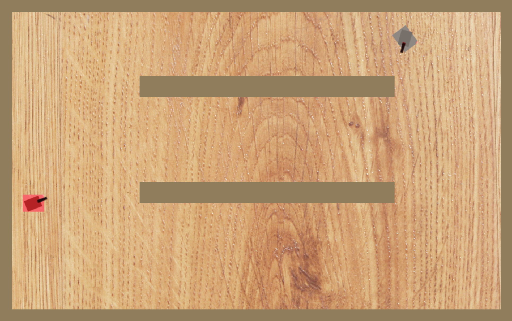
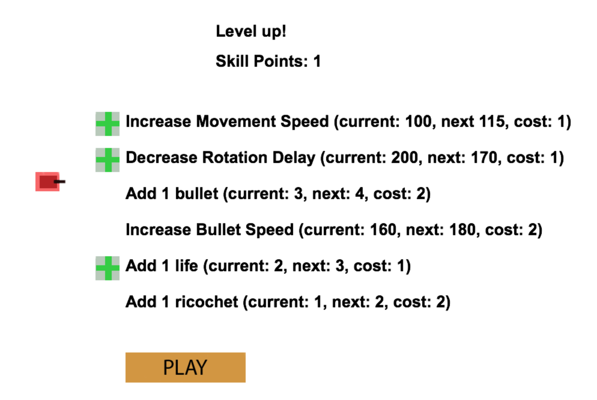

# Tanks!

As a kid, I loved the tanks minigame in Wii Play.  Since I no longer have access to a Wii, I decided to construct my own version.  This version is both singleplayer and multiplayer (buggy).  The first few levels are heavily inspired by the Wii Play version, but I then branched into my own custom levels, up to level 20.
  
It's playable but not fully complete (it's missing an ending screen).  I've also added skill points and upgrades to the game, so you too can have bullets as fast as those teal tanks.

Playable online on Heroku: https://enigmatic-reef-9847.herokuapp.com

Download zip and run:
```javascript
node index.js
```
Navigate to localhost:4004

## Frameworks and Libraries
It turns out that the entire singleplayer can be run without any backend (python -m SimpleHTTPServer would do the trick, actually).  Node.js and socket.io is used to sync multiplayer.  Handling the back-and-forth would be a huge pain, so I wrote a library called corridors (here: https://www.npmjs.com/package/corridors) to manage rooms, disconnection, etc.  It was immensely helpful, because when I built it I could ask myself "what would the perfect tool have?" and build a new feature on the spot.

## Gameplay (Level 2)


## Upgrades

